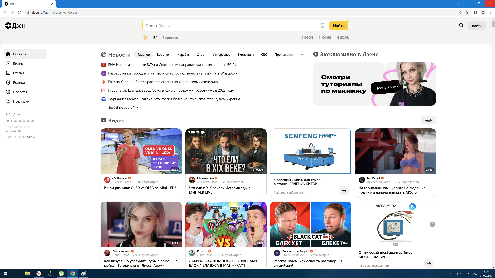

# Курс: "Знакомство с WEB технологиями"
## Домашнее задание №1

Задача: На основе сайта dzen.ru или gb.ru, или любой свой сайт(какой-то один сайт, не надо разные!):
1. Определите, на каком протоколе работает сайт.
2. Внесите не менее 10 изменений на страницу с помощью инструмента разработчика и представьте скриншоты было/стало.

Решение:
1. Протокол работы сайта dzen.ru - HTTPS, файлы
   * "1_протокол.png"  и
   * "2_сертификат_сайта.png" 
3. Изменения вносились в главную страницу сайта dzen.ru.
   * В файле "3_было.png"   приведен скриншот изначального вида сайта.
   * На скриншоте "4_Изменения_указатель.png" на скриншоте полученного результата красным цветом указаны основные изменения.
   * На скриншотах "5_Изменения_общий_вид.png" и "Изменения_работа_ссылок.png" приведен внешний вид результата, в том числе с демонстрацией наличия рабочих ссылок.
